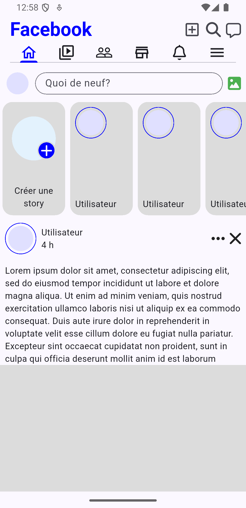
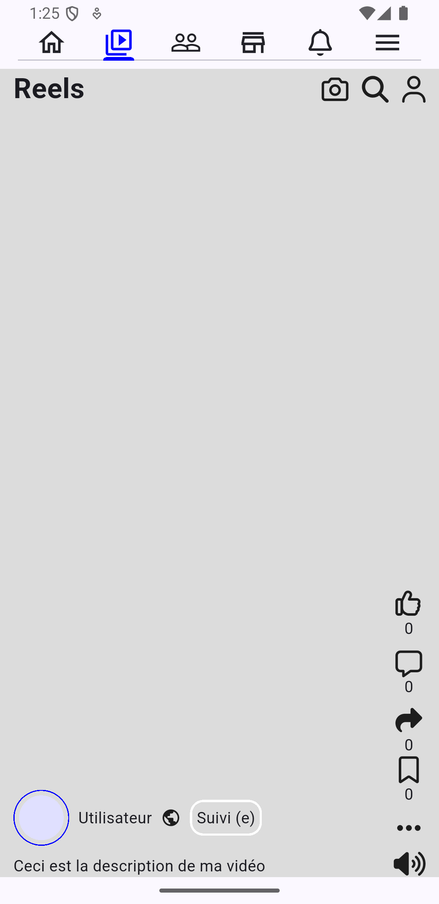
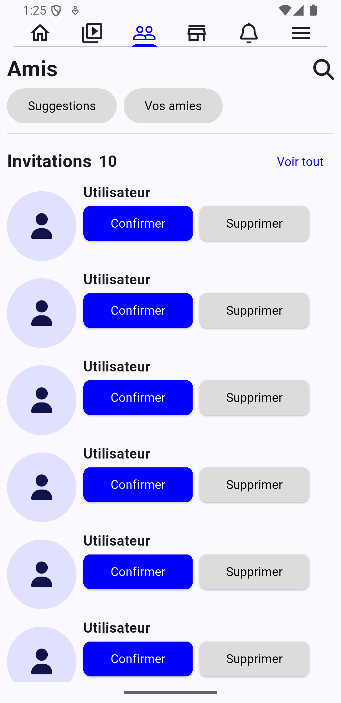
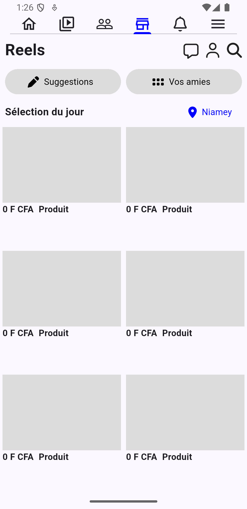
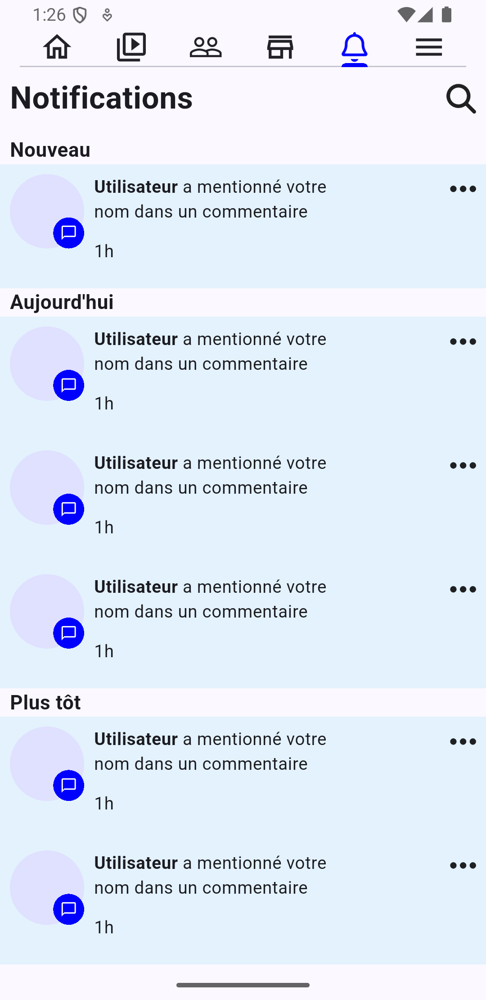

# Facebook clone

Une reproduction de l'interface de base de l'application facebook réalisé avec flutter.

## Écrans réalisés

- **Accueil**
- **Aperçu**
  

- **Reel**
- **Aperçu**
  

- **Invitations**
- **Aperçu**
  

- **Marketplace**
- **Aperçu**
  

- **Notifications**
- **Aperçu**
  

- **Menu**
- **Aperçu**
  

## Ce que j'ai appris

- Gestion et utilisation du NestedScrollview et des Slivers

## Packages principaux utilisé 
- `Google-fonts`
- `font-awesome_flutter`

